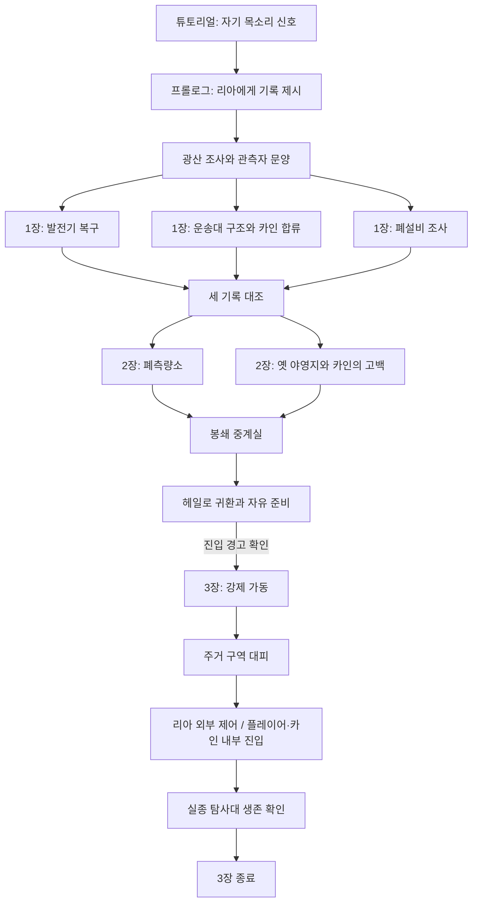

# 《침묵하는 관문》 메인 스토리 1~3장 구현 명세

> 기존 프로젝트에 추가하기 위한 Codex 작업 지시 문서다. 현재 프로젝트의 구조·명명 규칙·데이터 형식을 먼저 확인하고 그 형식에 맞춰 구현한다. 이 문서는 특정 엔진, 클래스명, 파일 구조를 새로 강제하지 않는다.

## 1. 구현 목표

튜토리얼 `HALO: 주거 구역 07` 이후부터 메인 스토리 3장 종료까지 플레이 가능한 퀘스트 흐름을 추가한다.

- 튜토리얼의 불가능한 자기 음성을 광산 구조 신호 조사로 연결한다.
- 리아를 첫 동료로, 카인을 1장 중반에 합류하는 동료로 구현한다.
- 초반의 개척지 경이감이 2장의 불안, 3장의 코스믹 호러로 점진적으로 바뀌게 한다.
- 메인 진행과 선택 의뢰 결과가 지역 외형, NPC 대사, 대피 방식에 남도록 한다.
- 3장은 N-0 내부에서 실종 탐사대를 확인하고 내외부 동시 제어의 필요성을 발견하는 지점에서 끝낸다.
- 리아의 실종, 관문 핵 파괴, 네레우스 신호는 4장 이후를 위해 보류한다.

## 2. 변경 금지 사항

- 게임은 싱글 플레이 쿼터뷰 2.5D 오픈 월드 RPG를 유지한다.
- 우주 밖 존재의 정체·형태·의도를 확정하거나 설명하지 않는다.
- 코스믹 호러 현상을 체력형 보스나 처치 가능한 적으로 만들지 않는다.
- 선택 의뢰 미완료를 리아의 실종이나 주민의 자동 사망 조건으로 사용하지 않는다.
- 플레이어의 음성, 관측자 문양, 실종 탐사선 신호가 같은 원인이라고 확정하지 않는다.
- 심연 관측국 구성원 전원을 악인으로 묘사하지 않는다.
- 3장에서는 차량 조종, 우주선 조종, 신규 행성, 관문망 전체 구현을 요구하지 않는다.

## 3. 권장 데이터 모델

프로젝트에 이미 퀘스트·대화·월드 상태 시스템이 있으면 아래 개념만 기존 형식으로 매핑한다. 없다면 최소한 다음 상태를 저장·복원할 수 있게 구성한다.

### 퀘스트 상태

`locked`, `available`, `active`, `completed`, `failed`를 기본으로 사용한다. 이 시나리오의 필수 퀘스트에는 시간 초과 실패를 두지 않는다.

### 영구 플래그

| 플래그 | 의미 |
|---|---|
| `tutorial.gate_signal_heard` | 전망대에서 자기 목소리 신호 확인 |
| `side.mara_power_restored` | 마라의 동쪽 전력 장치 복구 완료 |
| `main.mine_relay_coordinate_found` | 광산 유적에서 중계 좌표 확보 |
| `companion.ria_joined` | 리아 동료 합류 |
| `main.city_generator_restored` | 도시 발전기 복구 |
| `main.convoy_survivors_rescued` | 운송대 생존자 구조 |
| `companion.kain_joined` | 카인 동료 합류 |
| `main.scrapper_ledger_found` | 폐설비 기본 장부 확보 |
| `side.scrapper_detail_ledger_found` | 구매자 추적용 상세 장부 확보 |
| `side.convoy_vehicle_repaired` | 운송 차량 회수·수리 완료 |
| `main.survey_station_investigated` | 폐측량소 조사 완료 |
| `main.old_camp_investigated` | 옛 야영지 조사 완료 |
| `main.kain_retreat_revealed` | 카인의 과거 공개 |
| `choice.kain_response` | `understand`, `criticize`, `focus_present` 중 하나 |
| `main.veil_hypothesis_found` | 관문망이 장막이라는 가설 발견 |
| `main.observatory_documents_found` | 심연 관측국 내부 문서 확보 |
| `side.emergency_grid_ready` | 리아의 공동 비상 전력망 의뢰 완료 |
| `side.missing_belongings_delivered` | 카인의 유류품 전달 의뢰 완료 |
| `main.chapter3_committed` | 3장 진입 경고 확인 후 출발 |
| `choice.evacuation_priority` | `shelter_power` 또는 `signal_records` |
| `main.halo_evacuation_complete` | 필수 대피 현장 완료 |
| `main.gate_entry_reached` | N-0 내부 진입 |
| `main.missing_expedition_confirmed_alive` | 실종 탐사대 생존 확인 |
| `main.chapter3_complete` | 3장 종료 |

### 지역 단계

| 지역 | 단계 값 |
|---|---|
| 주거 구역 07 | `normal` → `uneasy` → `evacuation` |
| 초원·사막 이동로 | `open` → `marked_anomaly` → `evacuation_route` |
| 광산·폐광 | `signal_site` → `altered_records` → `cross_connected` |
| N-0 외곽 | `dormant` → `investigation` → `active_crisis` |
| N-0 내부 | `locked` → `entry_zone` |

지역 단계와 개별 의뢰 플래그는 분리한다. 메인 단계가 바뀌어도 완료한 선택 의뢰와 NPC 반응을 덮어쓰지 않는다.

## 4. 전체 진행 흐름

## 5. 프롤로그 — 낙하한 신호

### `MQ00_SIGNAL_FALLEN`

**선행 조건:** `tutorial.gate_signal_heard == true`

**시작:** 전망대 조사 이후 리아와 상호작용한다.

**목표 순서:**

1. 리아에게 신호 기록을 보여 준다.
2. 도시 수신망에서 광산 통신선 주소와 겹치는 중계 흔적을 확인한다.
3. 리아와 광산으로 이동한다. 이때 `companion.ria_joined = true`.
4. 끊긴 전력을 우회하고 폐쇄 구획을 통과한다.
5. 지하 유적에서 구조 신호와 관측자 문양을 조사한다.
6. 중계 좌표를 확보하고 헤일로로 귀환한다.

**필수 대사:**

- 리아: “장비가 거짓말할 수는 있어. 그래도 어디서부터 틀렸는지는 찾아봐야지.”
- 문양 조사 후 리아: “닮았다는 것하고, 널 가리킨다는 건 다른 얘기야. 아직은.”

**완료 결과:**

- `main.mine_relay_coordinate_found = true`
- N-0 외곽 설비가 지도에 표시된다.
- 1장의 세 메인 목표가 개방된다.
- 신호들의 동일 발신 여부는 퀘스트 로그에 `미확인`으로 남긴다.

## 6. 1장 — 빛나는 개척지

세 퀘스트는 원하는 순서로 진행한다. 장 완료 조건은 세 퀘스트 완료다.

### `MQ01A_CITY_POWER`

도시 발전기를 조사해 고장이 아니라 폐쇄 선로로의 주기적인 전력 유출임을 확인한다. 선로를 분리하면 정상 조명과 정비 시설이 복구되지만, 정지한 계기판 하나는 같은 주기로 움직인다.

**완료:** `main.city_generator_restored = true`

**선택 연결:** 리아와 휴대용 조명을 고치는 `SQ_RIA_PORTABLE_LIGHT`를 연다. 완료하면 캠프 소품과 관련 대사를 활성화한다.

### `MQ01B_MISSING_CONVOY`

사막 경계의 반복 구간에서 운송대 생존자들을 찾는다. 현장 인원은 5명이지만 무전에는 6명이 응답한다. 여섯 번째 응답은 과거 교신의 반복이며 구조 대상으로 확정하지 않는다.

카인은 다음 대사와 함께 안전한 우회로 확보를 우선한다.

> “대답이 온다고 그쪽으로 가면 안 됩니다. 먼저 여기 있는 사람부터 옮기죠.”

**완료:**

- `main.convoy_survivors_rescued = true`
- `companion.kain_joined = true`
- 거래와 이동로 안내 재개
- `SQ_CONVOY_VEHICLE_RECOVERY` 개방

### `MQ01C_ABANDONED_RELAY`

관문 외곽 폐설비를 점거한 약탈자를 조사한다. 전투 또는 거래 기록 제시로 해결할 수 있다. 두 방식 모두 핵심 진행과 기본 장부 확보가 가능해야 한다.

**필수 발견:** 광산 좌표, 전력 유출 주기, 운송대 이상 시각이 같은 설비 번호에 연결되어 있다.

**완료:** `main.scrapper_ledger_found = true`

**선택 결과:** 상세 장부를 찾으면 `side.scrapper_detail_ledger_found = true`와 구매자 추적 의뢰를 개방한다.

### `MQ01D_COMPARE_RECORDS`

세 퀘스트 완료 후 헤일로에서 자동 개방한다. 기록을 대조한 뒤 N-0 외곽 조명이 순차적으로 켜지는 연출을 재생한다.

**대사:** 리아: “문이 안 열렸다는 건 맞을 거야. 문 주위에서 아무 일도 없었다는 뜻은 아니고.”

**완료 조건:** 2장 외곽 수로 개방. 카인이 과거 탐사대의 진입로를 지도에 표시한다.

## 7. 2장 — 돌아오지 않은 사람들

### `MQ02A_RETURN_ROUTE`

N-0 외곽에서 폐측량소와 옛 야영지를 자유 순서로 조사한다. 공간 왜곡은 무작위 순간이동이 아니라 조명 표식, 설비 반응, 반복 환경음으로 해독 가능하게 만든다.

**폐측량소 결과:** `main.survey_station_investigated = true`. 폐쇄 시설을 정상 운용한 것으로 기록한 최근 보고서를 얻는다.

**옛 야영지 결과:** `main.old_camp_investigated = true`. 낡은 포장재와 따뜻한 물, 과거 탐사대 점호 기록을 발견한다.

### `MQ02B_KAIN_RETREAT`

옛 야영지 조사 중 카인이 과거 탐사대 경비원이었으며 동료를 남겨 두고 철수했다고 밝힌다.

**선택지:**

1. 이해한다 → `choice.kain_response = understand`
2. 숨긴 일을 비판한다 → `choice.kain_response = criticize`
3. 지금 할 일을 묻는다 → `choice.kain_response = focus_present`

선택은 후속 캠프 대사와 카인의 정보 공유 태도에만 영향을 준다. 즉시 이탈, 퀘스트 실패, 전투 능력 패널티를 만들지 않는다.

**필수 대사:**

- 카인: “돌아가면 찾을 수 있을 거라고 생각했습니다. 그때는 길이 없어질 수도 있다는 걸 몰랐습니다.”
- 리아: “이번엔 모르는 걸 모른다고 말해 줘. 그래야 같이 정하지.”

### `MQ02C_VEIL_RELAY`

두 조사 지점 완료 후 봉쇄 중계실을 연다. 선행 문명 도식과 탐사 기록을 조합해 N-0이 이동 장치인 동시에 어떤 관측을 막는 장막의 일부라는 가설을 얻는다.

인간 장비에서 심연 관측국 문서를 발견한다. 문서에는 실종 구역 고정이라는 가동 목적, 도시 전력망을 이용한 시험, 확대 가동 반대 의견의 삭제 흔적이 있어야 한다.

**완료:**

- `main.veil_hypothesis_found = true`
- `main.observatory_documents_found = true`
- 주거 구역 07을 `uneasy` 단계로 변경

### 2장 귀환 및 3장 진입

헤일로에서 날짜와 구매 기록의 불일치를 NPC 대사로 보여 준다. 자유 탐험, 상점, 남은 선택 의뢰는 유지한다.

3장 진입은 실제 시간 경과로 자동 발생시키지 않는다. 플레이어가 외곽 차단 설비 출발을 선택할 때 다음 경고를 표시한다.

> “출발하면 헤일로 일부 지역의 이동과 거래가 제한됩니다. 준비되지 않은 선택 의뢰는 사건 이후 다른 형태로 이어질 수 있습니다.”

확인 시 `main.chapter3_committed = true`.

## 8. 3장 — 관문이 열리는 밤

### `MQ03A_FORCED_ACTIVATION`

심연 관측국은 독립 전원으로 N-0을 가동한다. 플레이어가 설비 일부를 차단해도 이미 내부로 전달된 절차가 계속된다. 현장 책임자가 상부에 보낸 중단 요청은 잠시 뒤 동일한 목소리로 되돌아온다.

**필수 환경 변화:**

- 관문 너머의 밤하늘이 물리적으로 가까워 보인다.
- 방향이 다른 모든 창문에 동일한 별 배열이 비친다.
- 주거 구역 계단 하나가 광산 통로와 연결된다.
- 고가 선로 차량이 원래 역을 지나도 돌아오지 않는다.

카인의 “관문으로 가기 전에, 저 사람들부터.” 이후 대피 퀘스트로 전환한다.

### `MQ03B_HALO_EVACUATION`

주거 구역 07을 `evacuation` 단계로 바꾼다. 최소 3개의 현장 목표를 제공한다.

1. 닫힌 통로 개방
2. 부상자 이동
3. 전력 또는 통신 연결

**이전 선택 반영:**

| 조건 | 3장 반영 |
|---|---|
| `side.mara_power_restored` | 따뜻한 창문 빛과 비상등이 집결지 유도선이 됨 |
| 미완료 | 리아가 휴대 조명과 수동 개방 경로 제공 |
| `side.convoy_vehicle_repaired` | 차량이 부상자·물자 운반 연출에 등장 |
| 차량 미수리 | 도보 이동로 확보 목표 추가, 운전자들은 운반 지원 |
| `side.scrapper_detail_ledger_found` | 예비 전원 창고 위치를 즉시 확인 |
| 상세 장부 미확보 | 현장 단서를 조사해 같은 창고에 접근 |
| `side.emergency_grid_ready` | 대피소 전력 안정 시간이 늘고 보조 작업 감소 |

예비 자원의 우선 배정 선택지를 제공한다.

- 대피소 보조 전력 → `choice.evacuation_priority = shelter_power`
- 도시 수신 기록 보존 → `choice.evacuation_priority = signal_records`

두 선택 모두 메인 진행과 필수 구조를 보장한다. 차이는 에필로그의 물자 상태, 보존 로그, 후속 주민 의뢰에 남긴다.

**공포 연출:** 주민이 닫힌 집 안의 가족에게 문을 열라고 말하면 안에서 그 주민 자신의 목소리가 같은 문장을 반복한다. 실제 거주자를 측면 통로로 구조한 뒤에도 문 안의 대화는 계속된다. 조사 목표를 추가하지 않는다.

완료 시 `main.halo_evacuation_complete = true`.

### `MQ03C_OUTSIDE_HAND`

관측국 기술자가 외부 제어소 도면을 제공한다. 리아는 외부에서 귀환 연결을 유지하고, 플레이어와 카인은 내부 핵심 구조를 조사하기로 한다.

역할 분담은 희생 선택처럼 연출하지 않는다. 지원 인력, 예비 전원, 철수 순서, 통신 두절 시 복귀 기준이 준비되었음을 대사나 오브젝트로 보여 준다.

**필수 대사:** 리아: “들어가서 본 걸 그대로 말해 줘. 이해는 돌아와서 같이 하자.”

진입 시 `main.gate_entry_reached = true`.

### `MQ03D_UNFINISHED_ROLL_CALL`

관문 내부 `entry_zone`에는 외곽 야영지의 일부와 잘린 지면 아래 보이는 헤일로를 배치한다. 실종 탐사대원에게는 철수 직후의 짧은 시간만 흐른 것으로 설정한다.

다음 세 상호작용으로 이들이 녹화 영상이 아닌 살아 있는 사람임을 확인한다.

1. 탐사대원이 플레이어가 방금 떨어뜨린 표식을 집는다.
2. 방금 보낸 질문에 독립적으로 응답한다.
3. 현장에서는 접촉 가능하지만 리아의 외부 장비에는 빈 공간으로 표시된다.

통로 횡단 시험에서 물건은 건너가지만 탐사대원은 좌표가 끊기며 출발점으로 돌아온다. 실패 과정에서 탐사대원을 죽이지 않는다.

**필수 대사:** 카인: “늦었습니다. 지금은 여기 있습니다.”

**마지막 연출:**

- 내부 단말에서 내외부 동시 제어가 필요함을 확인한다.
- 리아의 실제 무전보다 먼저 거의 같은 음성이 다른 채널에서 재생된다.
- 두 음성의 마지막 단어만 다르다.
- 관측자 문양이 일행이 방금 서 있던 방향을 향하지만 움직이는 순간은 보여 주지 않는다.
- 카인이 탐사대원의 이름을 묻고 리아가 외부에서 받아 적는다.

**완료:**

- `main.missing_expedition_confirmed_alive = true`
- `main.chapter3_complete = true`
- 다음 메인 목표를 “내외부 제어를 유지하고 관문을 닫을 방법을 실행한다”로 등록

## 9. 선택 의뢰와 사건 이후 변환

미완료 선택 의뢰를 삭제하지 말고 사건 이후 목적을 변환한다.

| 사건 전 의뢰 | 사건 이후 연결 |
|---|---|
| 전등 수리 | 대피소 전원 확보 |
| 운송 차량 회수 | 남겨진 화물과 소유자 확인 |
| 탐사 장비 회수 | 실종 대원의 가족 또는 소유 기록 확인 |
| 광산 기록 조사 | 바뀐 기록 사본 비교 |
| 구매자 추적 | 관측국 내부의 가동 반대 인물 추적 |

이미 완료한 의뢰의 보상과 NPC 인지는 유지한다. 변환 의뢰는 4장 이후에도 이어갈 수 있게 데이터상 별도 ID를 사용한다.

## 10. 분위기와 표현 규칙

- 프롤로그와 1장: 넓은 시야, 발광 식생, 생활 소리, 동료의 자연스러운 대화.
- 2장: 기존 자산의 작은 불일치, 지연된 소리, 기록과 다른 지형. 화면을 단순히 어둡게 만들지 않는다.
- 3장: 불가능한 공간 연결과 익숙한 목소리의 부조화. 상호작용 대상과 이동 경로는 명확히 표시한다.
- 왜곡 길 찾기는 플레이어가 버그로 오해하지 않도록 반복되는 시각·음향 규칙을 제공한다.
- 모든 화면 텍스트와 대사는 한글로 표시하고 프로젝트의 UTF-8 처리 규칙을 따른다.

## 11. 구현 순서

1. 영구 플래그, 퀘스트 단계, 지역 단계의 저장·로드 연결
2. 프롤로그와 리아 동료 전환
3. 1장의 세 자유 순서 퀘스트와 합류 지점
4. 카인 합류와 동료 상황 대화
5. 2장의 두 조사 지점, 공간 퍼즐, 카인 선택 대화
6. 심연 관측국 문서와 3장 진입 경고
7. 3장의 월드 상태 전환과 대피 목표
8. 이전 선택 의뢰 결과의 대피 반영
9. 외부 제어소, N-0 내부 진입 구획, 실종 탐사대 장면
10. 저장 후 재진입, 지역 상태 복원, 미완료 의뢰 변환 검증

## 12. 완료 기준

- 튜토리얼 완료 데이터가 있으면 프롤로그를 정상 시작할 수 있다.
- 1장의 세 메인 퀘스트를 어떤 순서로 완료해도 같은 장 종료 지점에 도달한다.
- 리아와 카인의 합류 상태가 저장·불러오기 후 유지된다.
- 2장의 조사 순서가 바뀌어도 중계실이 올바르게 개방된다.
- 카인 선택 대화가 진행 차단 없이 후속 대사에 반영된다.
- 3장 진입 전 경고가 표시되고, 진입 후 지역 단계가 일관되게 바뀐다.
- 선택 의뢰 완료 여부에 따라 대피 방식과 대사는 달라지지만 메인 진행은 막히지 않는다.
- 대피 우선순위 두 선택 모두 3장 완료가 가능하다.
- 3장 종료 시 리아는 살아 있고 외부 제어소에 남아 있다.
- 리아 실종, 관문 핵 파괴, 네레우스 신호가 3장에 조기 노출되지 않는다.
- 저장·불러오기 후 퀘스트, NPC, 지역 외형, 접근 경로가 같은 상태로 복원된다.

## 13. 후속 구현을 위해 남겨 둘 연결점

- 4장: 리아의 외부 제어, 플레이어와 카인의 내부 핵 파괴, 예측 불가능한 공간 붕괴.
- 에필로그: 리아의 부재가 정비소, 장비, 대화, 지원 기능에 지속적으로 반영됨.
- 관문 붕괴 17일 후 네레우스에서 리아 명의의 신호 수신.
- 마지막 무전 후보: “여긴… 아직 빛이 있어.”
- 플레이어의 목소리, 관측자 문양, 선행 문명의 소멸, 우주 밖 존재는 장기 미스터리로 유지.

